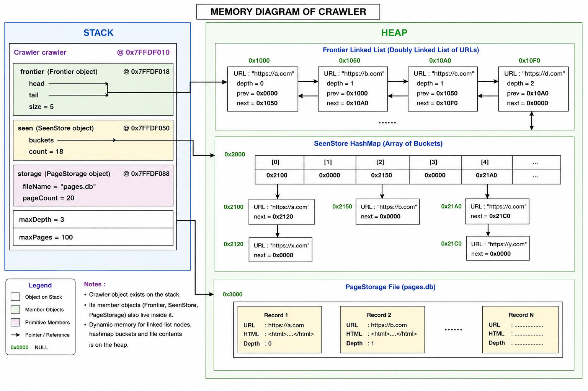

# Crawler 
The **Crawler** is the main controller of the web crawler. It manages the crawling process by retrieving URLs from the Frontier, ensuring that pages are not revisited using the SeenStore, downloading webpage content, storing the downloaded pages, and discovering new URLs until the specified crawling limits are reached.

## Section 1 — Public API

## Constructor

### **Crawler()**

Creates a crawler object and initializes all internal components required for crawling, including the Frontier, SeenStore, Fetcher, URLNormalizer, and PageStorage.

---

## Method 1

### **void crawl(std::string seedURL, int maxDepth, int maxPages)**

Starts crawling from the specified seed URL. The crawler repeatedly removes URLs from the Frontier, downloads webpages, stores them, extracts hyperlinks, normalizes discovered URLs, and schedules eligible URLs for future crawling until one of the stopping conditions is reached.

### Parameters

- `seedURL` : The initial URL from which crawling begins.
- `maxDepth` : Maximum hyperlink depth that may be explored.
- `maxPages` : Maximum number of webpages that may be downloaded.

### Returns

**void**

## Section 2 : Internal Representation 

The **Crawler** acts as the central coordinator of the web crawling system. It owns the major components required during crawling and controls how they interact throughout the execution of the program. Rather than implementing individual functionalities such as URL storage or page persistence itself, the crawler delegates these responsibilities to specialized components.

Internally, the crawler maintains:

A **Frontier** object that stores URLs waiting to be crawled.
A **SeenStore** object that records URLs that have already been discovered, preventing duplicate crawling.
A **Fetcher** object responsible for downloading webpage contents.
A **URLNormalizer** object that converts extracted hyperlinks into canonical absolute URLs.
A **PageStorage** object that stores downloaded webpages.
An integer **pageCount** that tracks the number of successfully downloaded webpages.

During execution, the crawler repeatedly removes a URL from the Frontier, downloads the webpage using the Fetcher, stores the page through the PageStorage component, extracts hyperlinks from the downloaded HTML, normalizes each discovered hyperlink using the URLNormalizer, filters invalid or previously seen URLs using the SeenStore, and inserts eligible URLs into the Frontier until the specified crawling limits are reached.

## Section 3 : Failure Handling 

The Crawler is designed to continue its execution even when individual webpages cannot be processed successfully. Instead of terminating the crawling process, it skips the failed URL and proceeds with the remaining URLs in the Frontier.

The crawler handles the following situations:

- **Empty Frontier:** If no URLs remain to be crawled, the crawling process terminates normally.

- **Already Visited URL:** If a URL is already present in the SeenStore, it is ignored to prevent duplicate crawling.

- **Page Download Failure:** If a webpage cannot be downloaded due to network errors, invalid URLs, or server-side issues, the page is skipped and crawling continues.

- **Maximum Depth Reached:** URLs whose depth exceeds the specified maximum depth are not added to the Frontier.

- **Maximum Page Limit Reached:** Crawling stops once the specified maximum number of pages has been processed.

- **Invalid or Empty URL:** Invalid or empty URLs are ignored and are not processed further.

- **URL Normalization Failure:** Hyperlinks that cannot be converted into valid absolute URLs are ignored and are not inserted into the Frontier.

By handling these conditions gracefully, the crawler ensures that failures affecting individual webpages do not interrupt the overall crawling process.

## Section 4 : Complexity Estimates 

### 1. `void crawl(std::string seedURL)`

**Time Complexity:** **O(P × (F + E × N))**

where:

- **P** = Number of webpages successfully crawled.
- **F** = Time required to fetch and store a webpage.
- **E** = Number of hyperlinks extracted and processed from a webpage.
- **N** = Time required to normalize a hyperlink and perform duplicate checking.

Each webpage is processed at most once because the SeenStore prevents duplicate visits. For every processed page, the crawler performs the following operations:

- Remove a URL from the Frontier.
- Check whether it has already been visited.
- Download the webpage.
- Store the webpage.
- Extract hyperlinks.
- Insert newly discovered URLs into the Frontier.

Since network communication dominates the execution time, the overall running time primarily depends on the number of pages crawled and the amount of processing required for each page.

## Section 5 — Private Methods

The following helper methods are used internally by the crawler to implement the crawling process. They are not part of the public interface and cannot be accessed directly by users of the class.

### **void extractLinks(const std::string& html, const std::string& baseURL, int currentDepth, int maxDepth)**

Extracts hyperlinks from the downloaded HTML document, converts relative URLs into normalized absolute URLs, filters invalid or previously discovered URLs, and inserts eligible URLs into the Frontier for future crawling.

### **bool shouldVisit(const std::string& url, int depth, int maxDepth)**

Determines whether a discovered URL should be crawled by checking that it is valid, has not been seen previously, and does not exceed the maximum crawling depth.

## Section 6 — Future Compatibility

The Crawler has been designed with a modular architecture, allowing future components to be integrated without significant modifications to its core logic.

The current design supports future development in the following ways:

- The crawler stores downloaded webpages using the **PageStorage** component, enabling the Project 03 **Indexer** to access and process the stored pages directly without requiring changes to the crawling process.

- The crawler interacts with other components such as **Frontier**, **SeenStore**, and **PageStorage** through their public interfaces, allowing these components to be replaced or improved independently while preserving the crawler's functionality.

- The crawling logic can be extended to support additional features such as URL filtering, crawl scheduling, or different traversal strategies without affecting the existing architecture.

- The design can be enhanced to support parallel or multi-threaded crawling by modifying the internal execution strategy while retaining the same public API.

