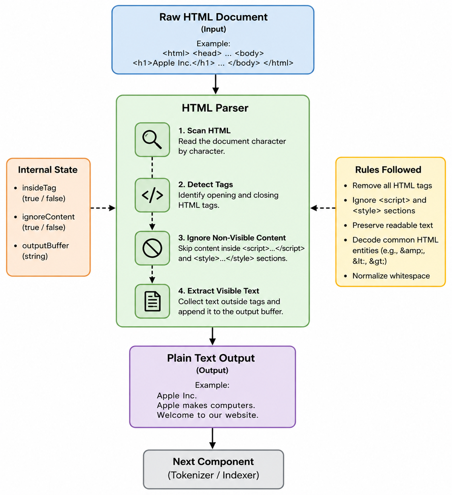

# HTML Parser

The **HTML Parser** is responsible for extracting the visible textual content from an HTML document. It removes HTML tags, ignores non-visible elements such as scripts, styles, and comments, normalizes whitespace, and returns plain text that can be further processed by the Indexer.

The Parser does not download webpages, tokenize text, normalize words, or build indexes. Its sole responsibility is to transform raw HTML into readable text.

---

# Section 1 — Public API

## Method 1

```cpp
std::string extractText(const std::string& html);
```

### Purpose

Extracts the visible text from an HTML document by removing HTML tags and non-visible content.

### Parameters

- `html` — The raw HTML content of a webpage.

### Returns

- A `std::string` containing the extracted plain text.
- An empty string if no visible text exists.

---

# Section 2 — Internal Representation



The HTML Parser is designed as a lightweight, stateless text-processing component. It scans the HTML document sequentially, detects HTML tags, skips non-visible content, collapses unnecessary whitespace, and copies only visible text into the output string.

Unlike a web browser, the Parser does not execute JavaScript, interpret CSS, or construct a Document Object Model (DOM). It simply extracts readable text suitable for indexing.

## Private Helper Methods

### 1. startsWithTag()

```cpp
bool startsWithTag(const std::string& html,
                   size_t pos,
                   const std::string& tag) const;
```

Checks whether the current parsing position begins with a specified HTML tag.

This helper is used to detect elements such as:

- `<script>`
- `<style>`
- `<!--`

---

### 2. skipUntilClosingTag()

```cpp
size_t skipUntilClosingTag(const std::string& html,
                           size_t pos,
                           const std::string& closingTag) const;
```

Skips all characters until the specified closing tag is encountered.

This function is primarily used for ignoring:

- `<script> ... </script>`
- `<style> ... </style>`

---

### 3. skipComment()

```cpp
size_t skipComment(const std::string& html,
                   size_t pos) const;
```

Skips HTML comments beginning with `<!--` and ending with `-->`.

Comment contents are excluded from the extracted text.

---

### 4. appendCharacter()

```cpp
void appendCharacter(std::string& output,
                     char ch) const;
```

Appends characters to the output while normalizing whitespace.

This helper ensures that multiple spaces, tabs, and newline characters are collapsed into a single space, producing clean plain text.

---

## Data Flow

The Parser performs the following sequence of operations internally:

1. Receive the raw HTML document.
2. Scan the document from beginning to end.
3. Detect HTML tags.
4. Skip HTML tags.
5. Ignore `<script>` sections.
6. Ignore `<style>` sections.
7. Ignore HTML comments.
8. Copy visible characters into the output.
9. Normalize consecutive whitespace.
10. Return the extracted plain text.

The parser processes the document sequentially and requires only a single pass over the HTML document.

---

# Section 3 — Failure Handling

The Parser is designed to tolerate malformed HTML whenever possible.

If the input HTML string is empty, the Parser immediately returns an empty string.

If malformed or incomplete HTML tags are encountered, the parser continues scanning the remaining document instead of terminating.

If a closing `</script>` or `</style>` tag cannot be found, the remaining portion of that section is ignored.

Malformed HTML comments are skipped until the end of the document.

If no visible text is found after processing the document, an empty string is returned.

By treating parsing errors as recoverable, the Parser ensures that malformed webpages do not interrupt the indexing process.

---

# Section 4 — Complexity Estimates

## extractText(const std::string& html)

**Time Complexity:** **O(n)**

where **n** is the number of characters in the HTML document.

### Explanation

- Each character is examined at most once.
- Tag detection requires constant-time comparisons.
- Script, style, and comment sections are skipped efficiently.
- Visible characters are appended directly to the output buffer.
- Whitespace normalization is performed during extraction.

Therefore, the running time grows linearly with the size of the HTML document.

**Space Complexity:** **O(n)**

where **n** is the size of the extracted plain text.

The parser stores only the generated plain text while processing the document.

---

# Section 5 — Future Compatibility

The HTML Parser has been designed as an independent preprocessing component that converts HTML into plain text. Because it performs only text extraction, future improvements can be added without affecting the Indexer or other crawler components.

Future versions may support:

- HTML entity decoding (`&amp;`, `&lt;`, `&gt;`, etc.)
- Unicode-aware parsing
- Extraction of page titles and metadata
- Ignoring additional non-visible HTML elements
- Preservation of paragraph and sentence boundaries
- HTML5-specific parsing rules

Since the Parser exposes a simple plain-text interface, these enhancements can be implemented while preserving the existing public API.