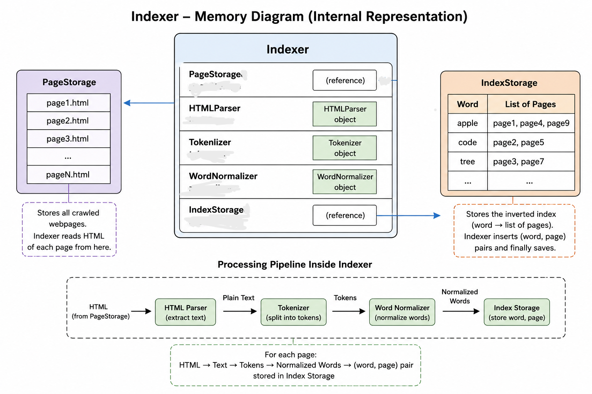

# Indexer

The **Indexer** is the core component of the indexing subsystem. It is responsible for building the inverted index by processing all webpages stored by the crawler. The Indexer coordinates the complete indexing pipeline by retrieving stored pages, extracting visible text, tokenizing the text, normalizing the generated tokens, and forwarding the processed words to the Index Storage.

After the complete inverted index has been constructed, the Indexer instructs the Index Storage to persist the index to disk so that it can be reused without rebuilding it in future executions.

The Indexer does not fetch webpages or answer search queries. Its sole responsibility is to coordinate the indexing process and construct the inverted index.

---

# Section 1 — Public API

## Method 1

```cpp
void buildIndex();
```

### Purpose

Processes all stored webpages, builds the complete inverted index, and persists the completed index using the Index Storage component.

### Parameters

None.

### Returns

None.

---

# Section 2 — Internal Representation



The Indexer acts as the coordinator of the indexing pipeline. It does not perform text processing itself; instead, it invokes the appropriate component at each stage of the pipeline and forwards the results to the next stage.

Each webpage is processed independently, allowing the indexing process to remain modular and scalable.

## Private Data Members

### 1. PageStorage& pageStorage

```cpp
PageStorage& pageStorage;
```

Provides access to all webpages previously stored by the crawler.

The Indexer retrieves each stored webpage sequentially from this component.

---

### 2. HTMLParser htmlParser

```cpp
HTMLParser htmlParser;
```

Extracts visible text from the HTML content of each webpage.

---

### 3. Tokenizer tokenizer

```cpp
Tokenizer tokenizer;
```

Splits the extracted text into individual tokens.

---

### 4. WordNormalizer normalizer

```cpp
WordNormalizer normalizer;
```

Converts every token into its normalized representation.

Invalid tokens such as punctuation-only tokens or numeric-only tokens are discarded during normalization.

---

### 5. IndexStorage& indexStorage

```cpp
IndexStorage& indexStorage;
```

Stores the mapping between normalized words and webpage IDs.

Each normalized word is associated with one or more page IDs representing the webpages in which the word appears. The corresponding webpage URL and HTML content can later be retrieved from `PageStorage` using the page ID.

After indexing is complete, the Index Storage persists the inverted index to disk.

---

## Data Flow

The Indexer performs the following sequence of operations internally:

1. Retrieve a webpage from Page Storage.
2. Extract visible text using the HTML Parser.
3. Tokenize the extracted text.
4. Normalize every generated token.
5. Discard empty or invalid normalized tokens.
6. Store each `(word, pageID)` pair using Index Storage.
7. Repeat the process for every stored webpage.
8. Persist the completed inverted index to disk.

---

# Section 3 — Failure Handling

The Indexer is designed to continue processing even if an individual webpage cannot be indexed.

If a webpage cannot be read from Page Storage, the Indexer skips that page and continues processing the remaining webpages.

If the HTML Parser produces no visible text, the webpage is ignored.

If the Tokenizer generates no tokens, the webpage contributes no entries to the inverted index.

Empty or invalid tokens returned by the Word Normalizer are discarded automatically.

If the Index Storage cannot persist the completed inverted index to disk, the indexing process itself still completes successfully in memory. Persistence failure does not interrupt the processing of webpages.

Failures encountered while processing one webpage do not interrupt the indexing of other webpages.

---

# Section 4 — Complexity Estimates

Assume:

* **P** = Number of webpages
* **T** = Total number of tokens across all webpages
* **U** = Number of unique normalized words

## buildIndex()

**Time Complexity:** **O(T)**

### Explanation

Each webpage is processed exactly once.

Every character is parsed once, every token is generated once, every token is normalized once, and every valid token is inserted into the inverted index once.

After indexing, the completed inverted index is written to disk in a single sequential pass. This persistence step is linear in the size of the index and does not change the overall asymptotic complexity of the indexing process.

**Space Complexity:** **O(U)**

where **U** is the number of unique normalized words stored in the inverted index.

Apart from the inverted index itself, the Indexer maintains only temporary data structures while processing one webpage at a time.

---

# Section 5 — Future Compatibility

The Indexer has been designed as an orchestration component that coordinates the complete indexing pipeline. Since each stage of processing is delegated to an independent component, new preprocessing or indexing techniques can be integrated without modifying the overall workflow.

